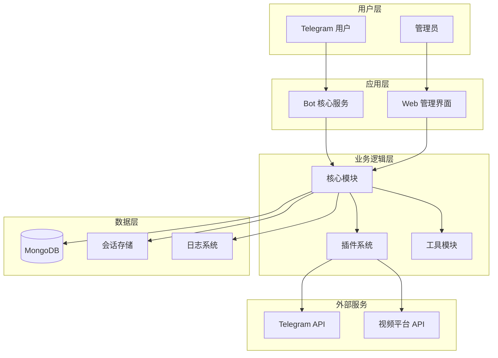

# Content-Bot 项目文档

Content-Bot 是一个基于 Python 的 Telegram 机器人，专门用于从 Telegram 频道和群组中获取受限消息，并支持从多个主流网站下载视频内容。

## 📖 文档导航

### 核心文档
- [架构设计](./1.ARCHITECTURE.md) - 系统架构和技术设计
- [接口文档](./2.INTERFACES.md) - API 接口和命令说明
- [开发者指南](./3.DEVELOPER_GUIDE.md) - 开发环境搭建和规范
- [Docker 部署指南](./Docker部署指南.md) - 容器化部署完整指南

### 快速开始

1. **项目概述**
   - 基于 Pyrogram V2 和 Telethon 框架
   - 支持公开/私有频道和群组的内容提取
   - 集成 yt-dlp 支持多平台视频下载
   - 提供会员系统和权限管理

2. **核心功能**
   - 🚀 从 Telegram 频道/群组提取受限内容
   - 📥 支持 YouTube、Instagram 等 100+ 网站视频下载
   - 🔐 128 位加密保护用户数据
   - 💰 会员系统和访问限制
   - 🗂️ 批量处理和自定义设置

3. **技术栈**
   - **后端**: Python 3.10+ with asyncio
   - **框架**: Pyrogram V2, Telethon, Flask
   - **数据库**: MongoDB
   - **视频处理**: yt-dlp, FFmpeg
   - **部署**: Docker, Docker Compose

## 🏗️ 系统架构



## 📁 项目结构

```
content-bot/
├── 📁 .mcai/docs/              # 项目文档
│   ├── 0.INDEX.md              # 文档索引
│   ├── 1.ARCHITECTURE.md       # 架构设计
│   ├── 2.INTERFACES.md         # 接口文档
│   ├── 3.DEVELOPER_GUIDE.md    # 开发指南
│   └── Docker部署指南.md       # Docker 部署指南
├── 📁 plugins/                 # 功能插件
│   ├── start.py               # 启动和帮助命令
│   ├── batch.py               # 批量处理
│   ├── login.py               # 用户登录
│   ├── ytdl.py                # 视频下载
│   ├── premium.py             # 会员系统
│   ├── settings.py            # 用户设置
│   ├── stats.py               # 统计功能
│   └── pay.py                 # 支付功能
├── 📁 utils/                   # 工具模块
│   ├── func.py                # 通用函数
│   ├── encrypt.py             # 加密工具
│   └── custom_filters.py      # 自定义过滤器
├── 📁 templates/               # Web 模板
│   └── welcome.html           # 欢迎页面
├── 📁 sessions/               # 用户会话（运行时）
├── 📁 logs/                   # 日志文件（运行时）
├── 📄 main.py                 # 应用入口
├── 📄 app.py                  # Web 服务
├── 📄 shared_client.py        # 共享客户端
├── 📄 config.py               # 配置管理
├── 📄 requirements.txt        # Python 依赖
├── 📄 Dockerfile              # Docker 镜像
├── 📄 docker-compose.yml      # Docker 编排
├── 📄 build.sh                # 构建脚本
└── 📄 deploy-docker.sh        # 部署脚本
```

## 🚀 快速部署

### Docker 部署（推荐）

```bash
# 1. 克隆仓库
git clone https://github.com/your-repo/content-bot.git
cd content-bot

# 2. 配置环境变量
cp .env.example .env
nano .env  # 编辑配置

# 3. 一键部署
./deploy-docker.sh production
```

### 本地部署

```bash
# 1. 安装依赖
pip3 install -r requirements.txt

# 2. 配置环境变量
cp .env.example .env

# 3. 启动服务
python3 main.py
```

## 🔧 核心功能模块

### 插件系统
- **启动插件** (`start.py`): 提供基础命令和帮助信息
- **批量处理** (`batch.py`): 支持批量提取和转发消息
- **用户认证** (`login.py`): 处理用户登录和会话管理
- **视频下载** (`ytdl.py`): 集成 yt-dlp 下载多平台视频
- **会员系统** (`premium.py`): 管理用户权限和订阅
- **个性化设置** (`settings.py`): 用户自定义配置
- **统计功能** (`stats.py`): 提供使用统计和分析

### 工具模块
- **通用函数** (`func.py`): 提供共享的业务逻辑函数
- **加密工具** (`encrypt.py`): 处理数据加密和解密
- **自定义过滤器** (`custom_filters.py`): 消息和用户过滤逻辑

## 📋 命令列表

| 命令 | 功能描述 | 权限要求 |
|------|----------|----------|
| `/start` | 启动机器人 | 所有用户 |
| `/help` | 显示帮助信息 | 所有用户 |
| `/login` | 用户登录 | 所有用户 |
| `/logout` | 用户登出 | 所有用户 |
| `/batch` | 批量处理 | 登录用户 |
| `/dl` | 下载视频 | 所有用户 |
| `/adl` | 下载音频 | 所有用户 |
| `/settings` | 个性化设置 | 所有用户 |
| `/status` | 查看状态 | 所有用户 |
| `/plan` | 查看会员计划 | 所有用户 |
| `/terms` | 服务条款 | 所有用户 |
| `/add` | 添加会员 | 管理员 |
| `/rem` | 移除会员 | 管理员 |
| `/stats` | 统计信息 | 管理员 |
| `/setbot` | 设置自定义机器人 | 管理员 |

## 🎯 使用场景

### 内容管理
- 从私有频道提取重要内容
- 批量备份和归档消息
- 跨频道内容转发和整理

### 视频下载
- 从 YouTube 下载教育视频
- 从 Instagram 保存媒体内容
- 从 Facebook 提取视频素材

### 团队协作
- 多用户协同管理内容
- 权限控制和访问管理
- 使用统计和性能监控

## 🔒 安全特性

- **数据加密**: 128 位 AES 加密保护用户会话
- **权限管理**: 多级用户权限和访问控制
- **安全配置**: 环境变量管理敏感信息
- **访问限制**: 强制订阅频道验证
- **会话管理**: 安全的用户会话存储和管理

## 📊 性能特点

- **异步处理**: 基于 asyncio 的高并发处理
- **批量操作**: 支持大规模批量消息处理
- **大文件支持**: 最大 4GB 文件上传
- **资源优化**: Docker 容器化部署和资源限制
- **监控告警**: 内置健康检查和日志监控

## 🤝 贡献指南

1. **代码规范**: 遵循 PEP 8 编码标准
2. **提交规范**: 使用语义化提交信息
3. **测试要求**: 新功能需要包含测试用例
4. **文档更新**: 及时更新相关文档

## 📞 获取支持

- **技术支持**: [Telegram 联系](https://t.me/team_spy_pro)
- **问题反馈**: [GitHub Issues](https://github.com/devgaganin/Save-Restricted-Content-Bot-V2/issues)
- **更新日志**: [项目更新](https://github.com/devgaganin/Save-Restricted-Content-Bot-V2/tree/v3#updates)

---

**开发者**: [devgagan](https://github.com/devgaganin) | **团队**: [Team SPY](https://t.me/team_spy_pro)

**许可证**: [GNU General Public License v3.0](../../LICENSE)
