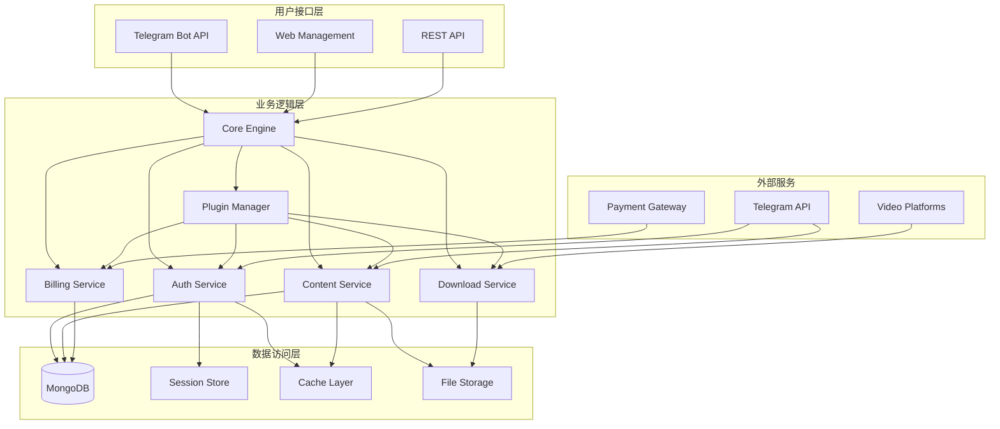
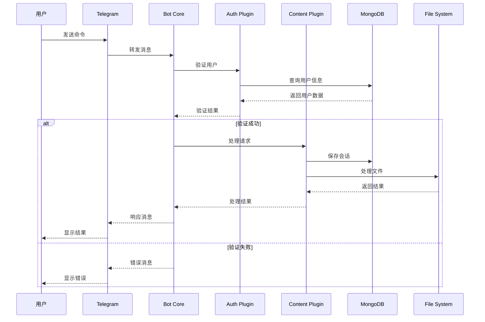
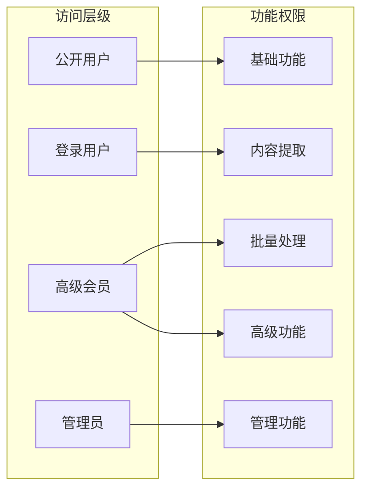
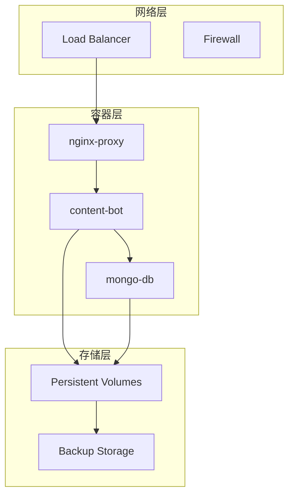

# 架构设计

Content-Bot 采用模块化的插件架构设计，基于异步 Python 技术栈，提供高性能的 Telegram 机器人服务。

## 📋 系统概述

Content-Bot 是一个专为 Telegram 平台设计的多功能机器人系统，主要用于：

- 从公开和私有频道/群组提取受限内容
- 支持多平台视频下载（YouTube、Instagram、Facebook 等）
- 提供用户认证和权限管理
- 实现批量处理和自定义设置
- 提供会员系统和商业化功能

系统采用微服务架构设计，支持水平扩展和高并发处理。

## 🛠️ 技术栈

### 核心技术

| 组件 | 技术 | 版本 | 用途 |
|------|------|------|------|
| **运行时** | Python | 3.10+ | 主要开发语言 |
| **异步框架** | asyncio | 内置 | 异步任务处理 |
| **Telegram 客户端** | Pyrogram | V2 | Bot API 和用户客户端 |
| **Telegram 客户端** | Telethon | 最新版 | 高级 Telegram 操作 |
| **Web 框架** | Flask | 2.2.2 | Web 管理界面 |
| **数据库** | MongoDB | 4.4+ | 用户数据和会话存储 |
| **视频处理** | yt-dlp | 最新版 | 多平台视频下载 |
| **媒体处理** | FFmpeg | 4.4+ | 音视频处理 |

### 支持技术

| 组件 | 技术 | 用途 |
|------|------|------|
| **容器化** | Docker | 应用部署和环境隔离 |
| **编排** | Docker Compose | 多容器服务编排 |
| **加密** | cryptography | 数据加密和安全 |
| **图像处理** | Pillow | 图片处理和缩略图 |
| **网络请求** | aiohttp | 异步 HTTP 客户端 |
| **数据验证** | pydantic | 数据模型验证 |
| **任务调度** | APScheduler | 定时任务管理 |

## 🏗️ 系统架构



## 📁 项目结构

```
content-bot/
├── 📄 main.py                 # 🚀 应用入口点和主循环
├── 📄 app.py                  # 🌐 Flask Web 服务入口
├── 📄 shared_client.py        # 🔗 共享客户端管理
├── 📄 config.py               # ⚙️ 配置管理和环境变量
├── 📄 requirements.txt        # 📦 Python 依赖包列表
├── 📄 Dockerfile              # 🐳 Docker 镜像构建文件
├── 📄 docker-compose.yml      # 🔄 Docker 服务编排配置
├── 📁 plugins/                 # 🔌 功能插件目录
│   ├── start.py              # 🎯 启动、帮助和基础命令
│   ├── batch.py              # 📦 批量消息处理
│   ├── login.py              # 🔐 用户认证和会话管理
│   ├── ytdl.py               # 📥 视频下载功能
│   ├── premium.py            # 💎 会员系统管理
│   ├── settings.py           # ⚙️ 用户个性化设置
│   ├── stats.py              # 📊 统计和分析功能
│   └── pay.py                # 💰 支付和订阅管理
├── 📁 utils/                   # 🛠️ 通用工具模块
│   ├── func.py               # 🔧 共享业务逻辑函数
│   ├── encrypt.py            # 🔒 数据加密和解密
│   └── custom_filters.py     # 🎛️ 消息和用户过滤器
├── 📁 templates/               # 🎨 Web 界面模板
│   └── welcome.html          # 🏠 欢迎页面模板
├── 📁 sessions/               # 🗂️ 用户会话存储（运行时）
└── 📁 logs/                   # 📝 应用日志存储（运行时）
```

## 🔌 核心子系统

### 1. 启动引擎 (main.py)

**职责**: 应用生命周期管理和插件系统初始化

**核心功能**:
- 异步事件循环管理
- 插件动态加载和执行
- 客户端启动和协调
- 错误处理和优雅关闭

**关键实现**:
```python
async def load_and_run_plugins():
    await start_client()
    plugin_dir = "plugins"
    plugins = [f[:-3] for f in os.listdir(plugin_dir) if f.endswith(".py")]
    
    for plugin in plugins:
        module = importlib.import_module(f"plugins.{plugin}")
        if hasattr(module, f"run_{plugin}_plugin"):
            await getattr(module, f"run_{plugin}_plugin")()
```

### 2. 共享客户端 (shared_client.py)

**职责**: 管理多个 Telegram 客户端的连接和生命周期

**核心功能**:
- Telethon 客户端管理（高级操作）
- Pyrogram 客户端管理（Bot API）
- Userbot 客户端管理（Premium 功能）
- 连接状态监控和重连机制

**客户端架构**:
```python
client = TelegramClient("telethonbot", API_ID, API_HASH)      # Telethon
app = Client("pyrogrambot", api_id=API_ID, api_hash=API_HASH, bot_token=BOT_TOKEN)  # Pyrogram Bot
userbot = Client("4gbbot", api_id=API_ID, api_hash=API_HASH, session_string=STRING)  # Userbot
```

### 3. 配置管理 (config.py)

**职责**: 统一管理应用配置和环境变量

**核心功能**:
- 环境变量加载和验证
- 安全密钥管理
- 会员计划配置
- 系统参数设置

**配置类别**:
- 📡 **API 配置**: Telegram API 凭据和连接参数
- 🗄️ **数据库配置**: MongoDB 连接和数据库设置
- 🔐 **安全配置**: 加密密钥和访问控制
- 💰 **商业配置**: 会员计划和定价
- 🎥 **媒体配置**: 下载和处理参数

### 4. 插件系统

**架构模式**: 基于事件驱动的插件架构

**插件生命周期**:
1. **发现**: 扫描 plugins 目录
2. **加载**: 动态导入插件模块
3. **初始化**: 调用插件初始化函数
4. **执行**: 响应 Telegram 事件
5. **清理**: 插件卸载和资源回收

#### 核心插件详解

**启动插件 (start.py)**
- 提供基础命令处理
- 用户帮助和导航
- 服务条款和计划展示
- 强制订阅验证

**批量处理插件 (batch.py)**
- 批量消息提取和转发
- 大文件分割处理
- 进度跟踪和状态管理
- 错误处理和重试机制

**认证插件 (login.py)**
- 用户登录和会话管理
- Session 字符串生成
- 权限验证和访问控制
- 多账户管理

**视频下载插件 (ytdl.py)**
- 多平台视频下载集成
- 格式转换和优化
- 进度显示和错误处理
- Cookie 管理和认证

**会员系统插件 (premium.py)**
- 订阅管理和权限控制
- 使用限制和配额管理
- 支付集成和订单处理
- 会员权益管理

### 5. 工具模块

**通用函数模块 (func.py)**
- 文件处理和格式转换
- 消息解析和内容提取
- 网络请求和 API 调用
- 数据验证和格式化

**加密模块 (encrypt.py)**
- AES 数据加密/解密
- 会话密钥管理
- 安全哈希计算
- 数据完整性验证

**过滤器模块 (custom_filters.py)**
- 用户权限过滤
- 消息类型过滤
- 内容安全检查
- 访问频率控制

## 🔄 数据流程



## 🔐 安全架构

### 访问控制



### 数据加密

- **会话数据**: 128 位 AES 加密存储
- **敏感信息**: 环境变量管理
- **传输安全**: HTTPS/TLS 加密
- **访问日志**: 完整的操作审计

### 权限矩阵

| 功能模块 | 公开用户 | 登录用户 | 高级会员 | 管理员 |
|----------|----------|----------|----------|--------|
| 基础命令 | ✅ | ✅ | ✅ | ✅ |
| 用户登录 | ✅ | ✅ | ✅ | ✅ |
| 单个下载 | ✅ | ✅ | ✅ | ✅ |
| 内容提取 | ❌ | ✅ | ✅ | ✅ |
| 批量处理 | ❌ | 限制 | ✅ | ✅ |
| 大文件上传 | ❌ | ❌ | ✅ | ✅ |
| 用户管理 | ❌ | ❌ | ❌ | ✅ |
| 系统配置 | ❌ | ❌ | ❌ | ✅ |

## 📊 性能优化

### 异步处理

- **事件循环**: 基于 asyncio 的非阻塞 I/O
- **并发控制**: 限制同时处理的任务数量
- **资源池**: 连接池和文件句柄管理
- **内存优化**: 流式处理大文件

### 缓存策略

- **用户会话**: 内存缓存 + MongoDB 持久化
- **API 响应**: 短期缓存减少重复请求
- **文件元数据**: 本地缓存提升访问速度

### 监控和告警

- **健康检查**: 定期检查服务状态
- **性能指标**: CPU、内存、网络使用率
- **错误追踪**: 异常日志和报警机制

## 🔧 部署架构

### 容器化部署



### 扩展策略

- **水平扩展**: 多实例负载均衡
- **垂直扩展**: 增加单实例资源配置
- **分片策略**: 按用户或功能模块分片
- **灾难恢复**: 多区域部署和备份

## 🔮 技术债务和改进方向

### 当前限制

1. **单点故障**: 核心服务缺乏高可用设计
2. **资源竞争**: 大文件处理可能阻塞其他操作
3. **监控不足**: 缺乏详细的性能监控和分析
4. **测试覆盖**: 自动化测试覆盖率有待提升

### 改进计划

1. **微服务化**: 拆分为独立的服务模块
2. **消息队列**: 引入 Redis/RabbitMQ 处理异步任务
3. **缓存优化**: 多层缓存策略提升性能
4. **监控体系**: 完整的 APM 和日志分析系统
5. **CI/CD**: 自动化构建、测试和部署流程

---

**架构设计原则**: 模块化、可扩展、高性能、安全可靠

**技术选型理由**: 成熟稳定、社区活跃、异步友好、容器化支持
